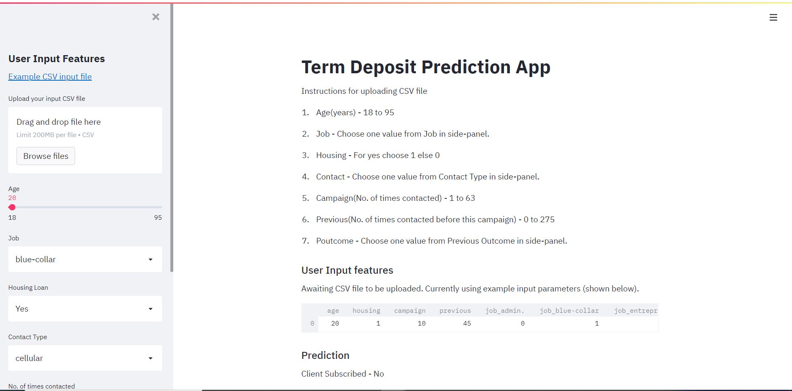

### Client Term Subscription 

This web application predicts whether the client will subscribe to the term deposit or not.

The data used to build the application is related with direct marketing campaigns of a Portuguese banking institution. The marketing campaigns were based on phone calls. Often, more than one contact to the same client was required, in order to know if the product (bank term deposit) would be subscribed or not.

Link of the dataset used :- [Dataset](https://github.com/bagladivyang03/term_deposit_prediction/blob/master/Model%20Build/term_deposit.csv)

#### This web application was built in Python using the following tools:
* streamlit
* pandas
* numpy
* scikit-learn
* pickle
* Jupyter Notebook

#### Screenshot of the deployed web application

Link of the deployed web application :- http://client-term-subscription.herokuapp.com/

